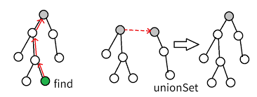
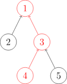
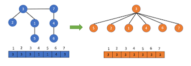
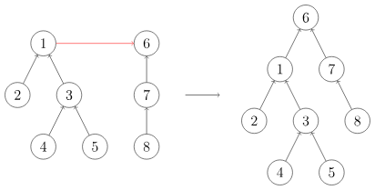

---
# You can also start simply with 'default'
theme: seriph
# random image from a curated Unsplash collection by Anthony
# like them? see https://unsplash.com/collections/94734566/slidev
background: https://cover.sli.dev
# some information about your slides (markdown enabled)
title: Disjoint Sets & Applications of Kruscal
info: |
  ## Slidev Starter Template
  Presentation slides for developers.

  Learn more at [Sli.dev](https://sli.dev)
# apply unocss classes to the current slide
class: text-center
# https://sli.dev/features/drawing
drawings:
  persist: false
# slide transition: https://sli.dev/guide/animations.html#slide-transitions
transition: slide-left
# enable MDC Syntax: https://sli.dev/features/mdc
mdc: true
# open graph
# seoMeta:
#  ogImage: https://cover.sli.dev
---

# Disjoint Sets <br/> & <br/> Application of Kruscal

Part 3 

<div @click="$slidev.nav.next" class="mt-12 py-1" hover:bg="white op-10">
  Press Space for next page <carbon:arrow-right />
</div>

<div class="abs-br m-6 text-xl">
  <button @click="$slidev.nav.openInEditor()" title="Open in Editor" class="slidev-icon-btn">
    <carbon:edit />
  </button>
  <a href="https://github.com/slidevjs/slidev" target="_blank" class="slidev-icon-btn">
    <carbon:logo-github />
  </a>
</div>

<!--
The last comment block of each slide will be treated as slide notes. It will be visible and editable in Presenter Mode along with the slide. [Read more in the docs](https://sli.dev/guide/syntax.html#notes)
-->

---
transition: fade-out
---

# What is Disjoint Set?



<v-click>

A <span v-mark.circle.red="1" class="font-bold">Disjoint-Set</span> (also known as <span v-mark.circle.red="1" class="font-bold">Union-Find</span>) is a data structure used to manage <span v-mark.orange="2" class="font-bold">a collection of disjoint sets</span>. It is implemented as a forest, where each tree represents a set and each node in the tree represents an element in that set.

</v-click>

As the name suggests, a disjoint-set supports two primary operations:

- **Find**: Determines which set a particular element belongs to by finding **the root of the corresponding tree**. This operation can be used to check whether two elements are in the same set.
- **Union**: Merges the sets that contain two given elements (i.e., merges the corresponding trees).


<br>
<br>


<!--
You can have `style` tag in markdown to override the style for the current page.
Learn more: https://sli.dev/features/slide-scope-style
-->

<style>
h1 {
  background-color: #2B90B6;
  background-image: linear-gradient(45deg, #4EC5D4 10%, #146b8c 20%);
  background-size: 100%;
  -webkit-background-clip: text;
  -moz-background-clip: text;
  -webkit-text-fill-color: transparent;
  -moz-text-fill-color: transparent;
}
</style>

<!--
Here is another comment.
-->

---
transition: slide-up
level: 2
---
  
# Initialize & Find

## Init

```python {*}{lines:true}
class DisjointSet:
    def __init__(self, size):
        self.pa = list(range(size))
```

At the beginning, each element is in its own separate set, represented as a tree with only a root node. For convenience, we set the parent of the root node to be itself.

## Find

```python {*}{lines:true}
def find(self, x):
    return x if self.pa[x] == x else self.find(self.pa[x])
```


<div class="flex items-center space-x-8">

  <!-- 左边：文字说明 -->
  <div class="w-2/3">
    <p class="mt-4">We need to move above along the tree until the root is found.</p>
  </div>

  <!-- 右边：图片展示 -->
  <div class="w-1/3">
    
  </div>

</div>


---
transition: slide-left
---
# Path Compression




Since all the elements we passed by to the root belong to the same set, we can directly connect them to the root node to acccelerate later `find`.


````md magic-move
```python {*}{lines:true}
def find(self, x):
    return x if self.pa[x] == x else self.find(self.pa[x])
```
```python {*}{lines:true}
def find(self, x):
    if self.pa[x] != x:
        self.pa[x] = self.find(self.pa[x])
    return self.pa[x]
```
````
<br>


---
transition: fade
---

# Union




To **union** two trees, we simply connect the root of one tree to the root of the other.

<br/>

```python {*}{lines:true}
def union(self, x, y):
    self.pa[self.find(x)] = self.find(y)
```
<br>

---
transition: fade
---

# Real-World Applications of Kruskal’s Algorithm

<br/>

Now that we’ve got the basics down, let’s explore how Kruskal’s Algorithm can save the day in **real-world scenarios**:

<br/>

- **Network Design**: The algorithm assists in designing efficient network connections, such as finding the most cost-effective way to connect cities or establishing communication links in a computer network.
- **Clustering**: Kruskal's algorithm aids in clustering analysis, where the algorithm identifies groups of similar data points by constructing minimum spanning trees based on pairwise similarity measures.
- **Approximation Algorithms**: Kruskal's algorithm serves as a fundamental building block for developing approximation algorithms, which provide near-optimal solutions to computationally challenging problems.
- ......
